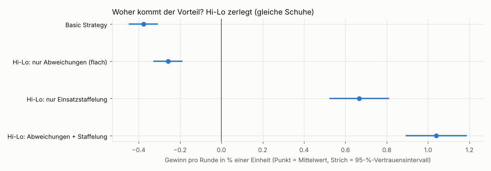
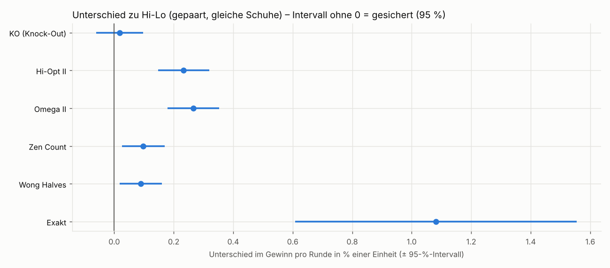

# Ergebnisse der Auswertung (Phase 6)

Erzeugt mit `python -m blackjack_assistant simulate` am 2026-10-07 12:26 (Seed 2026, Laufzeit 80 min). Alle Beträge in **Einheiten** (1 Einheit = Mindesteinsatz).

## Lesehilfe

- **„±“ ist immer ein 95-%-Vertrauensintervall** (halbe Breite): Der wahre Wert liegt mit 95 % Wahrscheinlichkeit im Bereich Mittelwert ± Intervall. Berechnet mit dem **Schuh als unabhängiger Einheit**, weil die Runden innerhalb eines Schuhs über den Count zusammenhängen.
- **Gewinn pro Runde** = Gesamtgewinn / Anzahl Runden, in % einer Einheit.
  **Vorteil pro Einsatz** = Gesamtgewinn / Summe der Starteinsätze.
- **Regeln:** 6 Decks, Schnittkarte bei 75 %, Dealer steht auf Soft 17, Blackjack 3:2, Double auf zwei Karten (auch nach Split), Split bis 4 Hände, Late Surrender, Dealer-Peek, Versicherung.

## Einstellungen

### Einsatzstaffelung (alle zählenden Varianten)

| Hi-Lo True Count | unter +2 | ab +2 | ab +3 | ab +4 | ab +5 |
|---|---:|---:|---:|---:|---:|
| **Einsatz** | 1 Einheit | 2 | 4 | 6 | 8 |

Spread 1–8. Basic Strategy setzt immer 1 Einheit. Für die anderen Systeme werden die Schwellen umgerechnet (**Näherung**, siehe unten):

| System | Count, ab dem 2 / 4 / 6 / 8 Einheiten gesetzt werden | Art |
|---|---|---|
| Hi-Lo | +2.0 / +3.0 / +4.0 / +5.0 | True Count (original Hi-Lo) |
| KO (Knock-Out) | -3.5 / +0.2 / +4.0 / +7.8 | Running Count, feste Schwellen |
| Hi-Opt II | +3.0 / +4.5 / +6.0 / +7.5 | True Count × 1.50 inkl. Ass-Korrektur |
| Omega II | +3.2 / +4.8 / +6.4 / +8.0 | True Count × 1.60 inkl. Ass-Korrektur |
| Zen Count | +3.4 / +5.1 / +6.8 / +8.5 | True Count × 1.70 |
| Wong Halves | +2.0 / +3.0 / +4.0 / +5.0 | True Count × 1.00 |
| Exakt | Vorteil ab −0,34 % + 1,0 / 1,5 / 2,0 / 2,5 % | berechneter Vorteil |

### Abweichungen (Indizes)

Die Illustrious 18 und Fab 4 sind **für Hi-Lo veröffentlicht** (Schlesinger, *Blackjack Attack*). **Alle Werte der anderen Systeme sind umgerechnet (Näherung)**: Bei den ausgeglichenen Systemen wird der Hi-Lo-Index mit dem Faktor des Systems multipliziert (Regression der Kartenwerte auf Hi-Lo), bei KO in eine feste Running-Count-Schwelle (Referenztiefe 37,5 % des Schuhs; Versicherung fest ab +3). Eigene, genauere Indizes lassen sich in `config/deviations.toml` eintragen.

| Abweichung | Hi-Lo (Original) | KO (Knock-Out) | Hi-Opt II | Omega II | Zen Count | Wong Halves |
|---|---:|---:|---:|---:|---:|---:|
| Versicherung (I18) | ab +3 | ab +3.0 | ab +4.5 | ab +4.8 | ab +5.1 | ab +3.0 |
| 16 gegen 10 stehen (I18) | ab +0 | ab -11.0 | ab +0.0 | ab +0.0 | ab +0.0 | ab +0.0 |
| 15 gegen 10 stehen (I18) | ab +4 | ab +4.0 | ab +6.0 | ab +6.4 | ab +6.8 | ab +4.0 |
| 10,10 gegen 5 teilen (I18) | ab +5 | ab +7.8 | ab +7.5 | ab +8.0 | ab +8.5 | ab +5.0 |
| 10,10 gegen 6 teilen (I18) | ab +4 | ab +4.0 | ab +6.0 | ab +6.4 | ab +6.8 | ab +4.0 |
| 10 gegen 10 verdoppeln (I18) | ab +4 | ab +4.0 | ab +6.0 | ab +6.4 | ab +6.8 | ab +4.0 |
| 12 gegen 3 stehen (I18) | ab +2 | ab -3.5 | ab +3.0 | ab +3.2 | ab +3.4 | ab +2.0 |
| 12 gegen 2 stehen (I18) | ab +3 | ab +0.2 | ab +4.5 | ab +4.8 | ab +5.1 | ab +3.0 |
| 11 gegen Ass verdoppeln (I18) | ab +1 | ab -7.2 | ab +1.5 | ab +1.6 | ab +1.7 | ab +1.0 |
| 9 gegen 2 verdoppeln (I18) | ab +1 | ab -7.2 | ab +1.5 | ab +1.6 | ab +1.7 | ab +1.0 |
| 10 gegen Ass verdoppeln (I18) | ab +4 | ab +4.0 | ab +6.0 | ab +6.4 | ab +6.8 | ab +4.0 |
| 9 gegen 7 verdoppeln (I18) | ab +3 | ab +0.2 | ab +4.5 | ab +4.8 | ab +5.1 | ab +3.0 |
| 16 gegen 9 stehen (I18) | ab +5 | ab +7.8 | ab +7.5 | ab +8.0 | ab +8.5 | ab +5.0 |
| 13 gegen 2 ziehen (I18) | unter -1 | unter -14.8 | unter -1.5 | unter -1.6 | unter -1.7 | unter -1.0 |
| 12 gegen 4 ziehen (I18) | unter +0 | unter -11.0 | unter +0.0 | unter +0.0 | unter +0.0 | unter +0.0 |
| 12 gegen 5 ziehen (I18) | unter -2 | unter -18.5 | unter -3.0 | unter -3.2 | unter -3.4 | unter -2.0 |
| 12 gegen 6 ziehen (I18) | unter -1 | unter -14.8 | unter -1.5 | unter -1.6 | unter -1.7 | unter -1.0 |
| 13 gegen 3 ziehen (I18) | unter -2 | unter -18.5 | unter -3.0 | unter -3.2 | unter -3.4 | unter -2.0 |
| 14 gegen 10 aufgeben (Fab4) | ab +3 | ab +0.2 | ab +4.5 | ab +4.8 | ab +5.1 | ab +3.0 |
| 15 gegen 10 aufgeben (Fab4) | ab +0 | ab -11.0 | ab +0.0 | ab +0.0 | ab +0.0 | ab +0.0 |
| 15 gegen 9 aufgeben (Fab4) | ab +2 | ab -3.5 | ab +3.0 | ab +3.2 | ab +3.4 | ab +2.0 |
| 15 gegen Ass aufgeben (Fab4) | ab +1 | ab -7.2 | ab +1.5 | ab +1.6 | ab +1.7 | ab +1.0 |

Bei KO sind die Werte Running Counts, sonst True Counts.

## Kurzfassung

- Basic Strategy ohne Zählen hat theoretisch -0.34 % pro Einheit (exakt berechnet).
- Langlauf (10'006'908 Runden pro Zählsystem): Hi-Lo mit Abweichungen und Spread 1–8 gewinnt +1.04 % ± 0.15 % pro Runde (+0.69 % pro eingesetzter Einheit); Basic Strategy -0.38 % ± 0.07 %.
- **Der Vorteil kommt vor allem aus der Einsatzvariation:** Von +1.42 % Mehrgewinn pro Runde gegenüber Basic Strategy stammen 92 % aus der Einsatzstaffelung (+1.30 % ± 0.11 %). Mit denselben Spielzügen, aber flachem Einsatz erreicht Hi-Lo nur -0.258 % ± 0.071 % pro Runde – also weiterhin einen Verlust; die Abweichungen allein bringen +0.119 % ± 0.042 % (gesichert).
- Rangliste im Langlauf: Omega II +1.31 %, Hi-Opt II +1.27 %, Zen Count +1.14 %, Wong Halves +1.13 %, KO (Knock-Out) +1.06 %, Hi-Lo +1.04 %. Von 15 Paarvergleichen sind 8 nach Bonferroni-Korrektur gesichert. Gesicherte **Rangstufen**: {Omega II, Hi-Opt II} > {Zen Count, Wong Halves, KO (Knock-Out), Hi-Lo} (innerhalb einer Stufe kein gesicherter Unterschied).
- Die exakte Strategie (theoretisches Maximum, 1'000'067 Runden) erreicht +2.54 % ± 0.62 % pro Runde. Die Zählsysteme holen davon 49–58 % des möglichen Zusatzgewinns gegenüber Basic Strategy (je etwa ± 12 Prozentpunkte).
- Die geforderten 10'000 Hände sind vom Zufall geprägt (Hi-Lo +262, Basic -211 Einheiten; Spielraum pro Runde bis ± 5.7 %).
- Wird nach jeder Runde gemischt, bringt Zählen nichts: Alle Zählsysteme spielen dann Basic Strategy mit 1 Einheit.

## 1. Die geforderten 10'000 Hände

| Variante | Modus | Gewinn gesamt | pro Runde | 95-%-Intervall | Vorteil pro Einsatz | Streuung pro Runde | Ø Einsatz | max. Rückgang |
|---|---|---:|---:|---:|---:|---:|---:|---:|
| Basic Strategy (ohne Zählen) | 75 % Penetration | -211.0 | -2.11 % | ± 2.32 % | -2.11 % | 1.14 | 1.00 | 248 |
| Hi-Lo | 75 % Penetration | +262.0 | +2.62 % | ± 3.75 % | +1.70 % | 2.45 | 1.54 | 142 |
| KO (Knock-Out) | 75 % Penetration | +199.0 | +1.99 % | ± 4.06 % | +1.25 % | 2.51 | 1.60 | 238 |
| Hi-Opt II | 75 % Penetration | +319.5 | +3.19 % | ± 4.52 % | +1.92 % | 2.69 | 1.67 | 187 |
| Omega II | 75 % Penetration | +238.5 | +2.38 % | ± 4.07 % | +1.47 % | 2.60 | 1.62 | 198 |
| Zen Count | 75 % Penetration | +189.0 | +1.89 % | ± 3.75 % | +1.23 % | 2.44 | 1.54 | 162 |
| Wong Halves | 75 % Penetration | +213.0 | +2.13 % | ± 3.57 % | +1.38 % | 2.45 | 1.54 | 152 |
| Exakt (Restzusammensetzung) | 75 % Penetration | +266.0 | +2.66 % | ± 5.66 % | +1.38 % | 3.16 | 1.92 | 200 |
| Basic Strategy (ohne Zählen) | Mischen nach jeder Runde | +40.5 | +0.40 % | ± 2.25 % | +0.40 % | 1.15 | 1.00 | 75 |
| Hi-Lo | Mischen nach jeder Runde | +40.5 | +0.40 % | ± 2.25 % | +0.40 % | 1.15 | 1.00 | 75 |
| KO (Knock-Out) | Mischen nach jeder Runde | +40.5 | +0.40 % | ± 2.25 % | +0.40 % | 1.15 | 1.00 | 75 |
| Hi-Opt II | Mischen nach jeder Runde | +40.5 | +0.40 % | ± 2.25 % | +0.40 % | 1.15 | 1.00 | 75 |
| Omega II | Mischen nach jeder Runde | +40.5 | +0.40 % | ± 2.25 % | +0.40 % | 1.15 | 1.00 | 75 |
| Zen Count | Mischen nach jeder Runde | +40.5 | +0.40 % | ± 2.25 % | +0.40 % | 1.15 | 1.00 | 75 |
| Wong Halves | Mischen nach jeder Runde | +40.5 | +0.40 % | ± 2.25 % | +0.40 % | 1.15 | 1.00 | 75 |
| Exakt (Restzusammensetzung) | Mischen nach jeder Runde | +52.0 | +0.52 % | ± 2.26 % | +0.52 % | 1.15 | 1.00 | 70 |

**Jev:** nicht simuliert – kein API-Key vorhanden. Mit Key: `python -m blackjack_assistant simulate` erneut ausführen; die Variante „Jev + Hi-Lo“ erscheint dann automatisch.

Bei 10'000 Runden ist das 95-%-Intervall des Gewinns pro Runde ± 2.3 % bis ± 5.7 % breit – grösser als die Unterschiede zwischen den Zählsystemen. Diese Tabelle eignet sich deshalb nicht für eine Rangliste; dafür ist der Langlauf da.

## 2. Langlauf: gleiche Schuhe für alle Varianten

Zählsysteme und Basic Strategy: je **10'006'908 Runden** (230'000 Schuhe); exakte Strategie: **1'000'067 Runden** (23'000 Schuhe, die ersten Schuhe derselben Folge).

| Variante | Spread 1–8: pro Runde | 95-%-Intervall | Vorteil pro Einsatz | Ø Einsatz | flacher Einsatz: pro Runde | 95-%-Intervall | Anteil am Maximum |
|---|---:|---:|---:|---:|---:|---:|---:|
| Basic Strategy | – | – | – | – | -0.377 % | ± 0.070 % | – |
| Hi-Lo | +1.039 % | ± 0.147 % | +0.69 % | 1.50 | -0.258 % | ± 0.071 % | 49 % |
| KO (Knock-Out) | +1.058 % | ± 0.151 % | +0.67 % | 1.57 | -0.289 % | ± 0.071 % | 49 % |
| Hi-Opt II | +1.272 % | ± 0.164 % | +0.78 % | 1.62 | -0.240 % | ± 0.071 % | 57 % |
| Omega II | +1.305 % | ± 0.163 % | +0.81 % | 1.62 | -0.229 % | ± 0.071 % | 58 % |
| Zen Count | +1.137 % | ± 0.150 % | +0.75 % | 1.51 | -0.237 % | ± 0.071 % | 52 % |
| Wong Halves | +1.129 % | ± 0.152 % | +0.74 % | 1.53 | -0.250 % | ± 0.071 % | 52 % |
| Exakt | +2.539 % | ± 0.616 % | +1.33 % | 1.91 | +0.144 % | ± 0.223 % | – |

*Anteil am Maximum* = (Gewinn pro Runde des Systems − Basic Strategy) / (Exakt − Basic Strategy). Die exakte Strategie ist das theoretische Maximum für Spielzüge, die nur die gesehenen Karten kennen. Weil sie weniger Runden hat, ist ihr Intervall breiter. 95-%-Intervall des Anteils (Näherung): Hi-Lo ± 11 Prozentpunkte, KO (Knock-Out) ± 11 Prozentpunkte, Hi-Opt II ± 12 Prozentpunkte, Omega II ± 12 Prozentpunkte, Zen Count ± 11 Prozentpunkte, Wong Halves ± 11 Prozentpunkte.

## 3. Woher kommt der Vorteil? Einsatz gegen Spielzüge

Gleiche Schuhe, vier Varianten von Hi-Lo (gepaarter Vergleich gegen Basic Strategy):

| Variante | pro Runde | 95-%-Intervall | Unterschied zu Basic | 95-%-Intervall | Bewertung |
|---|---:|---:|---:|---:|---|
| Basic Strategy, flacher Einsatz | -0.377 % | ± 0.070 % | – | – | Ausgangslage |
| Hi-Lo: nur Abweichungen (flacher Einsatz) | -0.258 % | ± 0.071 % | +0.119 % | ± 0.042 % | **gesichert** |
| Hi-Lo: nur Einsatzstaffelung (keine Abweichungen) | +0.667 % | ± 0.145 % | +1.044 % | ± 0.106 % | **gesichert** |
| Hi-Lo: Abweichungen + Einsatzstaffelung | +1.039 % | ± 0.147 % | +1.416 % | ± 0.124 % | **gesichert** |

Flacher Einsatz für alle Systeme (gleiche Spielzüge, immer 1 Einheit):

| System | mit Spread 1–8 | flacher Einsatz | Gewinn durch die Staffelung | 95-%-Intervall | flach minus Basic |
|---|---:|---:|---:|---:|---|
| Hi-Lo | +1.039 % | -0.258 % | +1.297 % | ± 0.109 % | +0.119 % |
| KO (Knock-Out) | +1.058 % | -0.289 % | +1.347 % | ± 0.111 % | +0.088 % |
| Hi-Opt II | +1.272 % | -0.240 % | +1.512 % | ± 0.126 % | +0.137 % |
| Omega II | +1.305 % | -0.229 % | +1.534 % | ± 0.125 % | +0.148 % |
| Zen Count | +1.137 % | -0.237 % | +1.374 % | ± 0.111 % | +0.140 % |
| Wong Halves | +1.129 % | -0.250 % | +1.379 % | ± 0.114 % | +0.127 % |
| Exakt | +2.539 % | +0.144 % | +2.395 % | ± 0.489 % | +0.521 % |

**Ergebnis:** Die Abweichungen allein (flacher Einsatz) verbessern Basic Strategy um +0.119 % ± 0.042 % pro Runde (gesichert) – das reicht nicht, um den Hausvorteil umzudrehen. Die Einsatzstaffelung bringt +1.297 % ± 0.109 %, das sind 92 % des gesamten Mehrgewinns. Der Gewinn entsteht also vor allem, weil bei hohem Count mehr gesetzt wird; wer immer gleich viel setzt, hat vom Zählen nur einen kleinen Teil des Nutzens.

## 4. Statistische Signifikanz

**Wann ist ein Unterschied gesichert?** Wenn das 95-%-Vertrauensintervall des *Unterschieds* die Null nicht enthält (|z| ≥ 1,96). Der Unterschied wird gepaart gemessen: beide Varianten spielen dieselben Schuhe, verglichen wird Schuh für Schuh. Das ist viel genauer als zwei unabhängige Intervalle nebeneinander – zwei überlappende Intervalle in der Tabelle oben bedeuten deshalb **nicht** automatisch „kein Unterschied“.

**Mehrfachvergleiche:** Bei 15 Paarvergleichen zwischen den Zählsystemen würde man schon rein zufällig etwa einen „signifikanten“ Unterschied finden. Für die Rangliste gilt deshalb die strengere Bonferroni-Grenze |z| ≥ 2.94 (Gesamtirrtum höchstens 5 %).

### Gegen Basic Strategy

| Variante | Unterschied pro Runde | 95-%-Intervall | z | Bewertung |
|---|---:|---:|---:|---|
| Hi-Lo | +1.416 % | ± 0.124 % | 22.4 | **gesichert** |
| KO (Knock-Out) | +1.435 % | ± 0.127 % | 22.1 | **gesichert** |
| Hi-Opt II | +1.649 % | ± 0.140 % | 23.1 | **gesichert** |
| Omega II | +1.682 % | ± 0.139 % | 23.7 | **gesichert** |
| Zen Count | +1.514 % | ± 0.126 % | 23.5 | **gesichert** |
| Wong Halves | +1.506 % | ± 0.128 % | 23.0 | **gesichert** |

### Zählsysteme untereinander

| Vergleich | Unterschied pro Runde | 95-%-Intervall | z | 95 % | Bonferroni |
|---|---:|---:|---:|---|---|
| Hi-Lo − Omega II | -0.266 % | ± 0.086 % | -6.0 | **gesichert** | **gesichert** |
| KO (Knock-Out) − Omega II | -0.247 % | ± 0.088 % | -5.5 | **gesichert** | **gesichert** |
| Hi-Lo − Hi-Opt II | -0.233 % | ± 0.086 % | -5.3 | **gesichert** | **gesichert** |
| KO (Knock-Out) − Hi-Opt II | -0.214 % | ± 0.087 % | -4.8 | **gesichert** | **gesichert** |
| Omega II − Zen Count | +0.168 % | ± 0.068 % | +4.8 | **gesichert** | **gesichert** |
| Omega II − Wong Halves | +0.176 % | ± 0.073 % | +4.7 | **gesichert** | **gesichert** |
| Hi-Opt II − Zen Count | +0.135 % | ± 0.070 % | +3.8 | **gesichert** | **gesichert** |
| Hi-Opt II − Wong Halves | +0.143 % | ± 0.082 % | +3.4 | **gesichert** | **gesichert** |
| Hi-Lo − Zen Count | -0.098 % | ± 0.072 % | -2.7 | **gesichert** | nicht gesichert |
| Hi-Lo − Wong Halves | -0.090 % | ± 0.071 % | -2.5 | **gesichert** | nicht gesichert |
| KO (Knock-Out) − Zen Count | -0.079 % | ± 0.078 % | -2.0 | **gesichert** | nicht gesichert |
| KO (Knock-Out) − Wong Halves | -0.071 % | ± 0.080 % | -1.7 | nicht gesichert | nicht gesichert |
| Hi-Opt II − Omega II | -0.033 % | ± 0.070 % | -0.9 | nicht gesichert | nicht gesichert |
| Hi-Lo − KO (Knock-Out) | -0.019 % | ± 0.079 % | -0.5 | nicht gesichert | nicht gesichert |
| Zen Count − Wong Halves | +0.008 % | ± 0.069 % | +0.2 | nicht gesichert | nicht gesichert |

### Exakte Strategie gegen die anderen (auf den gemeinsamen Schuhen)

| Vergleich | Unterschied pro Runde | 95-%-Intervall | z | Bewertung |
|---|---:|---:|---:|---|
| Exakt − Basic Strategy | +2.733 % | ± 0.547 % | +9.8 | **gesichert** |
| Exakt − Hi-Lo | +1.081 % | ± 0.474 % | +4.5 | **gesichert** |
| Exakt − KO (Knock-Out) | +0.925 % | ± 0.473 % | +3.8 | **gesichert** |
| Exakt − Hi-Opt II | +0.801 % | ± 0.459 % | +3.4 | **gesichert** |
| Exakt − Omega II | +0.789 % | ± 0.457 % | +3.4 | **gesichert** |
| Exakt − Zen Count | +0.981 % | ± 0.465 % | +4.1 | **gesichert** |
| Exakt − Wong Halves | +1.004 % | ± 0.461 % | +4.3 | **gesichert** |
| Exakt − Exakt – flacher Einsatz | +2.395 % | ± 0.489 % | +9.6 | **gesichert** |

**Was ist gesichert, was nicht?**

- Gesichert: Jedes Zählsystem mit Spread schlägt Basic Strategy deutlich (z zwischen 22 und 24).
- Gesichert: Die exakte Strategie ist besser als jedes Zählsystem (kleinster Abstand: Omega II, +0.789 %, z = 3.4).
- Gesicherte Unterschiede zwischen Zählsystemen (Bonferroni): Hi-Lo vs. Hi-Opt II (-0.233 %); Hi-Lo vs. Omega II (-0.266 %); KO (Knock-Out) vs. Hi-Opt II (-0.214 %); KO (Knock-Out) vs. Omega II (-0.247 %); Hi-Opt II vs. Zen Count (+0.135 %); Hi-Opt II vs. Wong Halves (+0.143 %); Omega II vs. Zen Count (+0.168 %); Omega II vs. Wong Halves (+0.176 %).
- Nur auf 95-%-Niveau, aber nicht nach Bonferroni gesichert: Hi-Lo vs. Zen Count; Hi-Lo vs. Wong Halves; KO (Knock-Out) vs. Zen Count.
- **Gesicherte Rangstufen** (nach Bonferroni): {Omega II, Hi-Opt II} > {Zen Count, Wong Halves, KO (Knock-Out), Hi-Lo}. Innerhalb einer Stufe ist kein Unterschied gesichert.
- Die Rangliste weicht von der Betting Correlation ab (dort liegt Wong Halves vorn). Mögliche Gründe (Deutung, nicht gemessen): Die Betting Correlation bewertet nur die Kartenwerte für den Einsatz; im Langlauf zählen auch die Spielzüge (siehe Spalte „flach minus Basic“ in Abschnitt 3) und die umgerechneten Einsatzschwellen und Indizes – siehe nächster Punkt.
- Bei den übrigen 4 Paaren ist kein Unterschied nachweisbar – die Systeme sind dort im Rahmen der Messgenauigkeit gleich gut.
- **Wichtig:** Gemessen wird die Kombination aus Kartenwerten, umgerechneten Indizes und umgerechneter Einsatzstaffelung. Ein Unterschied kann auch von der Näherung bei den Indizes/Schwellen kommen und nicht nur von der „Qualität“ des Systems.

## 5. Zählsysteme ohne Zufall: Betting Correlation

Die *Betting Correlation* misst, wie gut die Kartenwerte eines Systems die tatsächliche Wirkung jeder Karte auf den Spielervorteil abbilden (Effects of Removal, exakt berechnet). 1.00 wäre perfekt. Sie hängt nicht vom Glück ab, sagt aber nichts über die Spielzüge.

| System | Betting Correlation | mit Ass-Korrektur |
|---|---:|---:|
| Hi-Lo | 0.962 | – |
| KO (Knock-Out) | 0.958 | – |
| Hi-Opt II | 0.921 | 0.973 |
| Omega II | 0.929 | 0.981 |
| Zen Count | 0.959 | – |
| Wong Halves | 0.993 | – |

Effects of Removal (Änderung des Spielervorteils in %, wenn eine Karte entfernt wird): 2: +0.069, 3: +0.083, 4: +0.113, 5: +0.145, 6: +0.078, 7: +0.040, 8: -0.011, 9: -0.041, 10: -0.092, A: -0.093. Theoretischer Erwartungswert der Basic Strategy mit vollem Schuh: -0.337 % pro Einheit.

## 6. Tiefer Schuh gegen Mischen nach jeder Runde

- Tiefer Schuh (75 %): im Schnitt 43.5 Runden pro Schuh; der Count kann sich aufbauen, Einsatz und Spielzüge passen sich an.
- Mischen nach jeder Runde: 10'000 Mischvorgänge in 10'000 Runden. Alle Zählsysteme setzen dann immer 1 Einheit (Ø Einsatz 1.00) und spielen Basic Strategy – identische Ergebnisse wie ohne Zählen.
- Viele Online-Casinos (auch im Demo-Modus) mischen nach jeder Runde oder ziehen jede Karte per Zufallsgenerator – genau dieser Fall. Das Overlay warnt dann mit „Zählen hier wirkungslos“.

## Methode

- Simulator mit denselben Regeln wie das Mock-Casino; der Spieler sieht jede offene Karte (die Hole Card wird am Rundenende aufgedeckt). Perfekte Erkennung angenommen.
- **10'000 Hände:** gleicher Seed für alle Varianten (jeder Schuh wird gleich gemischt).
- **Langlauf:** Alle Varianten spielen **dieselben Schuhe** (Blöcke à 2'000 Schuhe mit festem Seed, parallel auf 4 Prozessen). Unterschiede werden Schuh für Schuh verglichen (gepaarter Vergleich); das verkleinert den Zufallsspielraum stark, weil beide Varianten dieselben Karten bekommen.
- Zählsysteme: Running Count → True Count (Restdecks auf halbe Decks gerundet), Abweichungen und Einsatzstaffelung wie oben. KO mit festen Running-Count-Schwellen.
- Exakt: Jede Entscheidung aus der genauen Restzusammensetzung (alle gesehenen Karten entfernt). Einsatz nach dem linear geschätzten Vorteil, umgerechnet in einen Hi-Lo-äquivalenten True Count (0,5 % Vorteil ≈ 1 TC), dieselbe Staffelung.
- Flacher Einsatz: gleiche Zählung und gleiche Spielzüge (inkl. Abweichungen), aber immer 1 Einheit.

