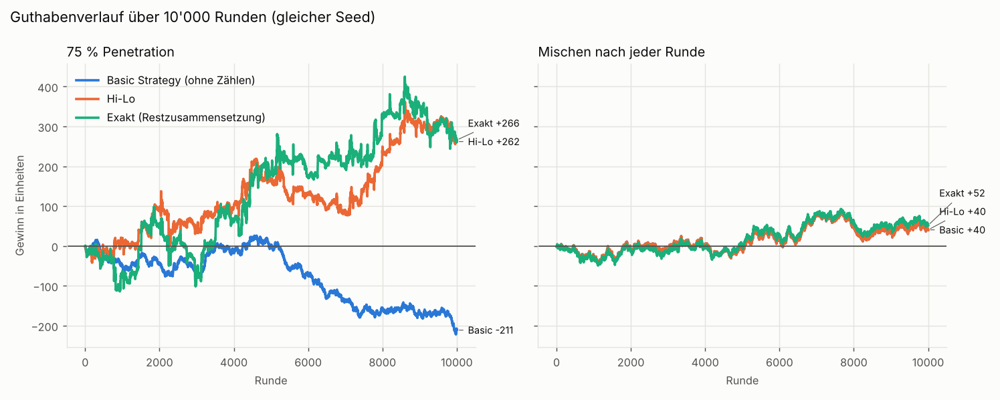
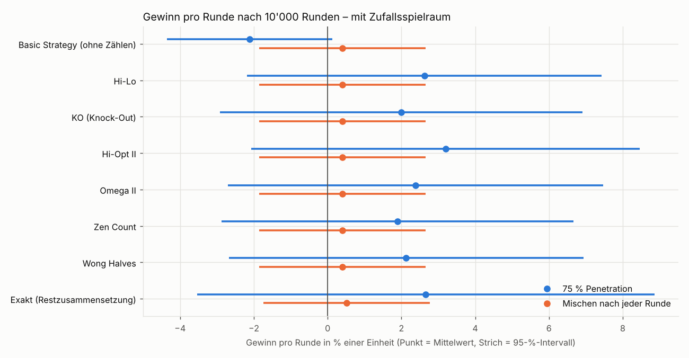
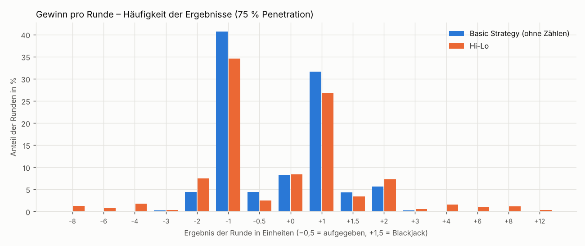
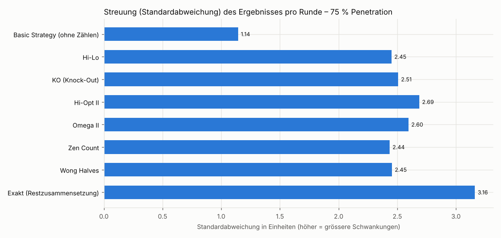
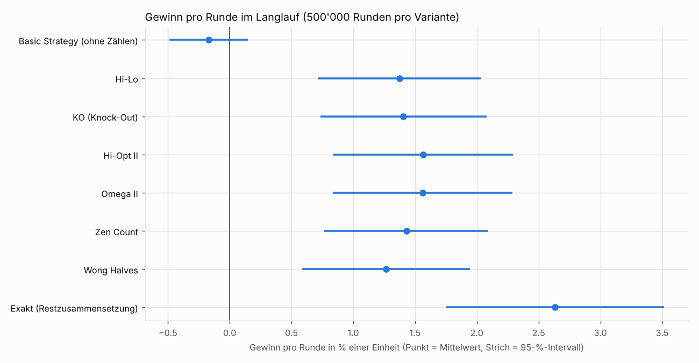
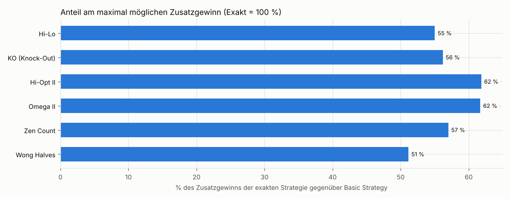
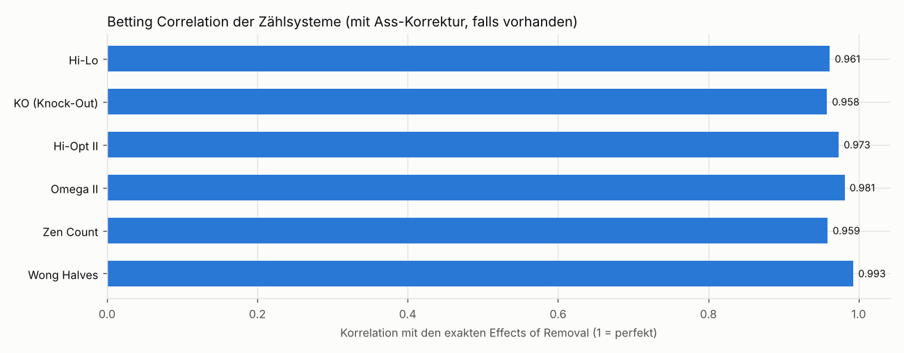

# Ergebnisse der Auswertung (Phase 6)

Erzeugt mit `python -m blackjack_assistant simulate` am 2026-10-07 10:24 (Seed 2026, Laufzeit 523 s). Alle Beträge in **Einheiten** (1 Einheit = Mindesteinsatz).

**Regeln:** 6 Decks, Dealer steht auf Soft 17, Blackjack 3:2, Double auf zwei Karten (auch nach Split), Split bis 4 Hände, Late Surrender, Dealer-Peek, Versicherung.
**Einsatz der zählenden Spieler:** 1 Einheit bis TC +1, ab +2: 2, ab +3: 4, ab +4: 6, ab +5: 8 (Spread 1–8). Basic Strategy setzt immer 1 Einheit.

## Kurzfassung

- Basic Strategy ohne Zählen verliert langfristig: theoretisch -0.34 % pro Einheit (exakt berechnet), im Langlauf -0.17 % ± 0.32 % pro Runde.
- Mit Hi-Lo, Abweichungen und Spread 1–8 dreht der Vorteil ins Plus: +1.37 % pro Runde (± 0.66 %), +0.92 % pro eingesetzter Einheit.
- Die exakte Strategie (theoretisches Maximum) erreicht +2.63 % pro Runde (+1.39 % pro eingesetzter Einheit). Die Zählsysteme holen davon 51–62 % des möglichen Zusatzgewinns; am meisten Hi-Opt II (+1.56 %). Die Unterschiede zwischen den Systemen liegen innerhalb des Zufallsspielraums.
- In den geforderten 10'000 Händen ist das Ergebnis vom Zufall geprägt: Hi-Lo +262 Einheiten, Basic -211, Exakt +266 (95-%-Spielraum pro Runde ca. ± 4.8 %).
- Zählen erhöht die Schwankungen deutlich: Streuung pro Runde 2.45 Einheiten statt 1.14 (Basic), weil bei hohem Count mehr gesetzt wird.
- Wenn nach jeder Runde gemischt wird, bringt Zählen nichts: Alle Zählsysteme spielen dann Basic Strategy mit 1 Einheit; auch die exakte Strategie kann nur noch die Karten der laufenden Runde nutzen.

## 1. Die geforderten 10'000 Hände

| Variante | Modus | Gewinn gesamt | pro Runde | ± 95 % | Vorteil pro Einsatz | Streuung pro Runde | Ø Einsatz | max. Rückgang |
|---|---|---:|---:|---:|---:|---:|---:|---:|
| Basic Strategy (ohne Zählen) | 75 % Penetration | -211.0 | -2.11 % | 2.24 % | -2.11 % | 1.14 | 1.00 | 248 |
| Hi-Lo | 75 % Penetration | +262.0 | +2.62 % | 4.80 % | +1.70 % | 2.45 | 1.54 | 142 |
| KO (Knock-Out) | 75 % Penetration | +199.0 | +1.99 % | 4.92 % | +1.25 % | 2.51 | 1.60 | 238 |
| Hi-Opt II | 75 % Penetration | +319.5 | +3.19 % | 5.27 % | +1.92 % | 2.69 | 1.67 | 187 |
| Omega II | 75 % Penetration | +238.5 | +2.38 % | 5.09 % | +1.47 % | 2.60 | 1.62 | 198 |
| Zen Count | 75 % Penetration | +189.0 | +1.89 % | 4.77 % | +1.23 % | 2.44 | 1.54 | 162 |
| Wong Halves | 75 % Penetration | +213.0 | +2.13 % | 4.81 % | +1.38 % | 2.45 | 1.54 | 152 |
| Exakt (Restzusammensetzung) | 75 % Penetration | +266.0 | +2.66 % | 6.20 % | +1.38 % | 3.16 | 1.92 | 200 |
| Basic Strategy (ohne Zählen) | Mischen nach jeder Runde | +40.5 | +0.40 % | 2.25 % | +0.40 % | 1.15 | 1.00 | 75 |
| Hi-Lo | Mischen nach jeder Runde | +40.5 | +0.40 % | 2.25 % | +0.40 % | 1.15 | 1.00 | 75 |
| KO (Knock-Out) | Mischen nach jeder Runde | +40.5 | +0.40 % | 2.25 % | +0.40 % | 1.15 | 1.00 | 75 |
| Hi-Opt II | Mischen nach jeder Runde | +40.5 | +0.40 % | 2.25 % | +0.40 % | 1.15 | 1.00 | 75 |
| Omega II | Mischen nach jeder Runde | +40.5 | +0.40 % | 2.25 % | +0.40 % | 1.15 | 1.00 | 75 |
| Zen Count | Mischen nach jeder Runde | +40.5 | +0.40 % | 2.25 % | +0.40 % | 1.15 | 1.00 | 75 |
| Wong Halves | Mischen nach jeder Runde | +40.5 | +0.40 % | 2.25 % | +0.40 % | 1.15 | 1.00 | 75 |
| Exakt (Restzusammensetzung) | Mischen nach jeder Runde | +52.0 | +0.52 % | 2.26 % | +0.52 % | 1.15 | 1.00 | 70 |

**Jev:** nicht simuliert – kein API-Key vorhanden (Jev: kein API-Key → lokale Strategie (offline)). Mit Key: `python -m blackjack_assistant simulate` erneut ausführen; die Variante „Jev + Hi-Lo“ erscheint dann automatisch.

**Wichtig zur Einordnung:** Bei 10'000 Runden ist das 95-%-Vertrauensintervall des Gewinns pro Runde ±2.2 bis ±6.2 % einer Einheit breit – grösser als der Unterschied zwischen den Zählsystemen und ungefähr so gross wie der Vorteil, den Zählen überhaupt bringt. Ein einzelner Lauf mit 10'000 Händen kann deshalb nicht zuverlässig zeigen, welche Strategie besser ist; Glück überwiegt. Darum zusätzlich der Langlauf unten.

## 2. Langlauf mit 500'000 Runden pro Variante (75 % Penetration)

| Variante | Gewinn pro Runde | ± 95 % | Vorteil pro Einsatz | Ø Einsatz | Anteil am Maximum |
|---|---:|---:|---:|---:|---:|
| Basic Strategy (ohne Zählen) | -0.170 % | 0.32 % | -0.17 % | 1.00 | – |
| Hi-Lo | +1.373 % | 0.66 % | +0.92 % | 1.49 | 55 % |
| KO (Knock-Out) | +1.406 % | 0.67 % | +0.90 % | 1.56 | 56 % |
| Hi-Opt II | +1.564 % | 0.73 % | +0.97 % | 1.61 | 62 % |
| Omega II | +1.560 % | 0.73 % | +0.97 % | 1.61 | 62 % |
| Zen Count | +1.429 % | 0.66 % | +0.95 % | 1.50 | 57 % |
| Wong Halves | +1.264 % | 0.68 % | +0.83 % | 1.53 | 51 % |
| Exakt (Restzusammensetzung) | +2.634 % | 0.88 % | +1.39 % | 1.90 | – |

*Anteil am Maximum* = (Gewinn pro Runde des Systems − Basic Strategy) / (Exakt − Basic Strategy). Die exakte Strategie ist das theoretische Maximum für Spielzüge, die nur die gesehenen Karten kennen.

## 3. Zählsysteme ohne Zufall: Betting Correlation

Die *Betting Correlation* misst, wie gut die Kartenwerte eines Systems die tatsächliche Wirkung jeder Karte auf den Spielervorteil abbilden (Effects of Removal, exakt berechnet). 1.00 wäre perfekt. Sie hängt nicht vom Glück ab.

| System | Betting Correlation | mit Ass-Korrektur |
|---|---:|---:|
| Hi-Lo | 0.962 | – |
| KO (Knock-Out) | 0.958 | – |
| Hi-Opt II | 0.921 | 0.973 |
| Omega II | 0.929 | 0.981 |
| Zen Count | 0.959 | – |
| Wong Halves | 0.993 | – |

Effects of Removal (Änderung des Spielervorteils in %, wenn eine Karte entfernt wird): 2: +0.069, 3: +0.083, 4: +0.113, 5: +0.145, 6: +0.078, 7: +0.040, 8: -0.011, 9: -0.041, 10: -0.092, A: -0.093. Theoretischer Erwartungswert der Basic Strategy mit vollem Schuh: -0.337 % pro Einheit.

## 4. Tiefer Schuh gegen Mischen nach jeder Runde

- Tiefer Schuh (75 %): im Schnitt 43.5 Runden pro Schuh, der Count kann sich aufbauen, Einsatz und Spielzüge passen sich an.
- Mischen nach jeder Runde: 10000 Mischvorgänge in 10000 Runden. Hi-Lo setzt dann immer 1 Einheit (Ø Einsatz 1.00) und hat denselben Nachteil wie Basic Strategy.
- Viele Online-Casinos (auch im Demo-Modus) mischen nach jeder Runde oder nutzen einen Zufallsgenerator pro Karte – genau dieser Fall. Das Overlay warnt dann mit „Zählen hier wirkungslos“.

## Methode

- Simulator mit denselben Regeln wie das Mock-Casino; der Spieler sieht jede offene Karte (Hole Card wird am Rundenende aufgedeckt).
- Gleicher Seed für alle Varianten: Jeder Schuh wird gleich gemischt. Weil die Spieler verschieden spielen, laufen die Kartenfolgen danach trotzdem auseinander.
- Zählsysteme: Running Count → True Count (Restdecks auf halbe Decks gerundet), Illustrious 18 + Fab 4 (für andere Systeme umgerechnet), Einsatzstaffelung wie oben. KO mit festen Schwellen.
- Exakt: Jede Entscheidung aus der genauen Restzusammensetzung (alle gesehenen Karten entfernt). Einsatz nach dem linear geschätzten Vorteil, umgerechnet in einen Hi-Lo-äquivalenten True Count (0,5 % Vorteil ≈ 1 TC) und dieselbe Staffelung.
- Bei „Mischen nach jeder Runde“ wissen die Zähler, dass das Zählen wirkungslos ist, und spielen Basic Strategy mit 1 Einheit.

